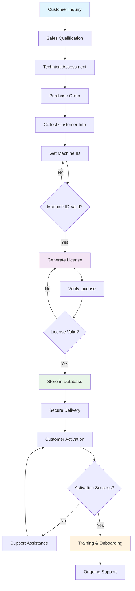
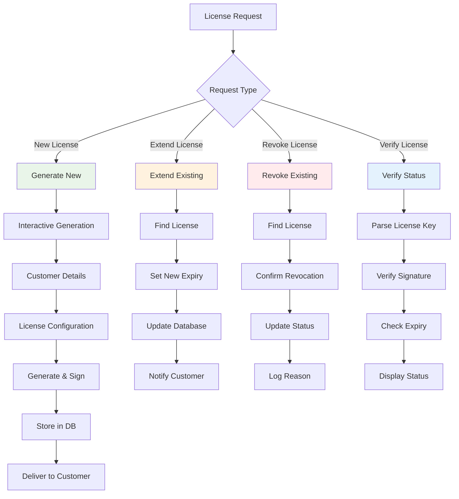
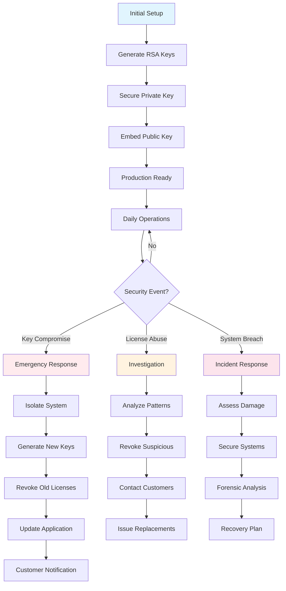
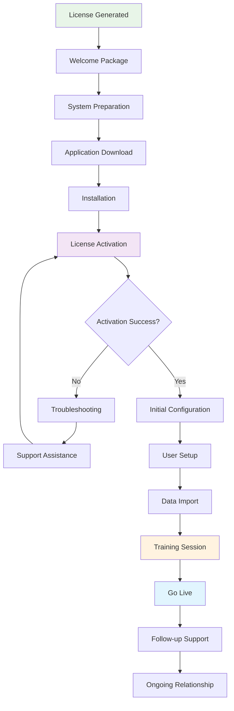
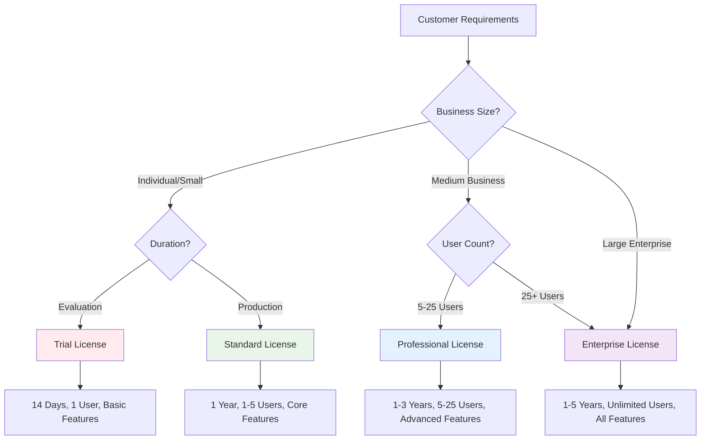
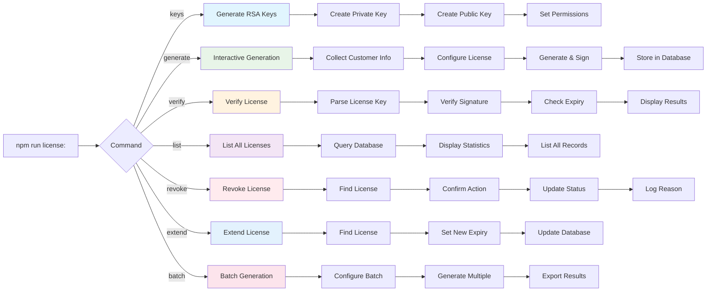

# License Generation Workflow Diagram 📊

## Production License Workflow



## License Management Workflow



## Security Workflow



## Customer Onboarding Flow



## License Types Decision Tree



## Command Flow Reference



---

## Quick Reference Commands

### Setup Commands
```bash
cd license-generator
npm install                    # Install dependencies
npm run license:keys          # Generate RSA key pair (first time)
npm test                      # Verify installation
```

### Daily Operations
```bash
npm run license:generate      # Generate new license
npm run license:verify [key]  # Verify license key
npm run license:list          # View all licenses
npm run license:extend [id]   # Extend license
npm run license:revoke [id]   # Revoke license
```

### Batch Operations
```bash
npm run license:batch         # Generate multiple licenses
```

### Emergency Commands
```bash
npm run license:keys          # Generate new key pair (if compromised)
npm run license:list | grep "ACTIVE"  # List active licenses
```

---

**📋 This workflow ensures secure, efficient license generation and management for LaundryPro customers.**